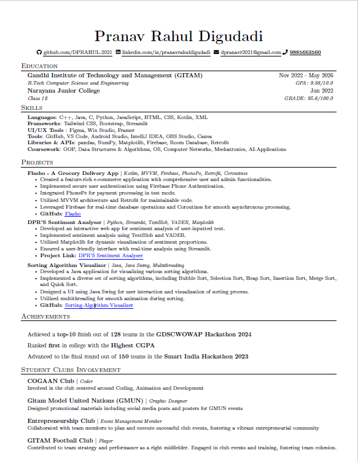

# Professional Resume

This repository contains the LaTeX source code for my professional resume. It includes sections for education, skills, projects, and involvement in student clubs. The resume is typeset using LaTeX, providing a clean and professional layout.

Feel free to fork this repository and customize the content to create your own personalized resume.

